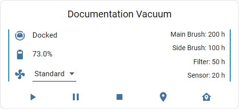
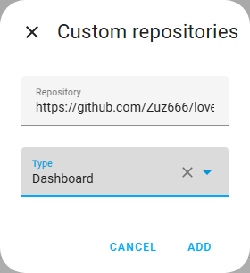
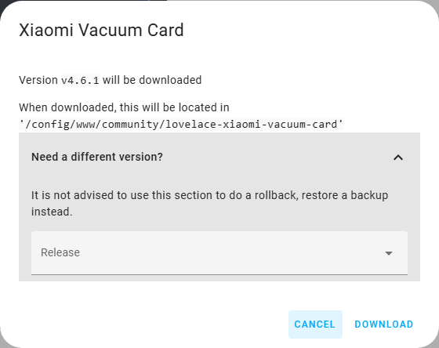
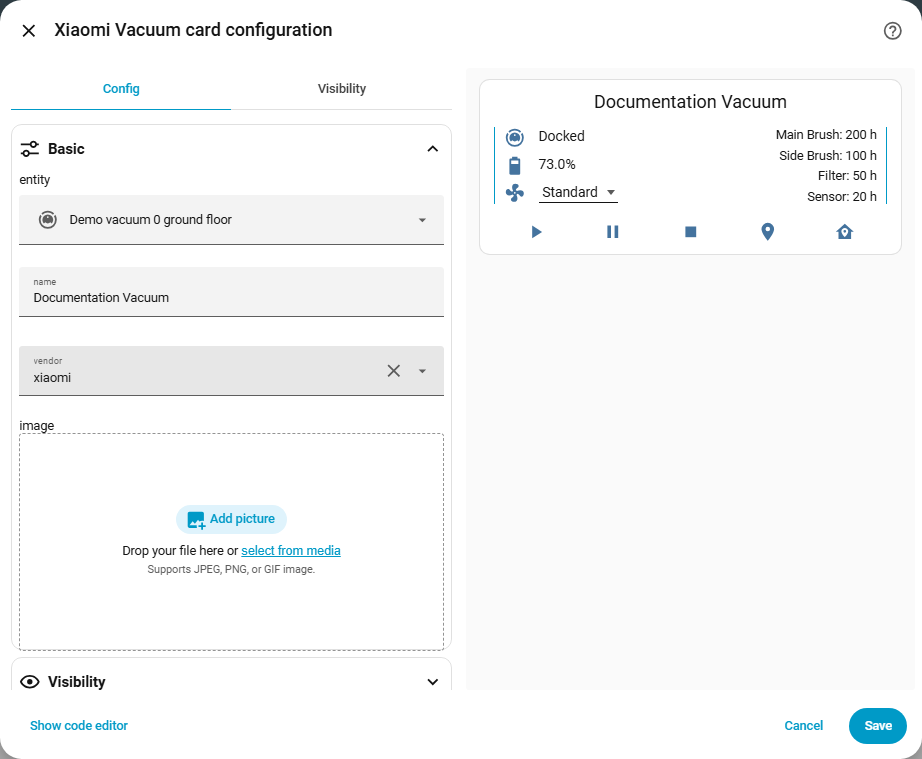
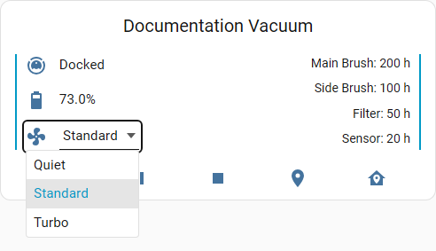
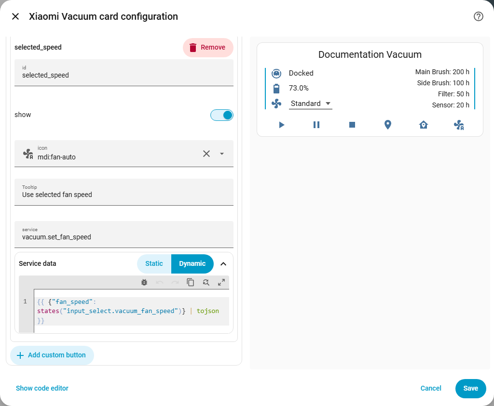
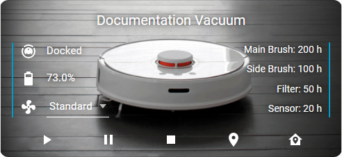

# Xiaomi Vacuum Card Reborn

[](https://github.com/Zuz666/lovelace-xiaomi-vacuum-card/releases)
[](https://github.com/Zuz666/lovelace-xiaomi-vacuum-card/releases)
[](https://github.com/Zuz666/lovelace-xiaomi-vacuum-card/commits/main)
[](https://github.com/Zuz666/lovelace-xiaomi-vacuum-card)
[](https://hacs.xyz/)
[](https://github.com/Zuz666/lovelace-xiaomi-vacuum-card/actions/workflows/ci.yml)

A maintained, modern Home Assistant Lovelace custom card for vacuum cleaners. Forked from [benct/lovelace-xiaomi-vacuum-card](https://github.com/benct/lovelace-xiaomi-vacuum-card) and updated for modern Home Assistant versions, sections-view dashboards, and direct HACS / browser module loading.



## Highlights

- **Modern Home Assistant Compatibility**: Built without legacy Web Components (`mwc-menu`/`mwc-list-item`), using standard Lovelace elements and native browser APIs.
- **Card Picker & Visual Editor**: Full integration with the Home Assistant dashboard editor, including card preview, suggestions, entity filtering, and structured GUI configuration for all card sections.
- **Accessible Fan Speed Combobox**: Full keyboard navigation (`ArrowUp`, `ArrowDown`, `Home`, `End`, `PageUp`, `PageDown`, `Enter`, `Space`, `Escape`, `Tab`) and clean ARIA listbox support.
- **Device-Registry Battery & Charging Discovery**: Automatically discovers battery sensors (`device_class: battery`) and charging binary sensors (`device_class: battery_charging`) attached to the vacuum device in the Home Assistant device registry, including renamed entities, with fallbacks for naming conventions and vacuum attributes.
- **Static & Dynamic Service Calls**: Configure custom buttons with static payloads or dynamic Jinja templates evaluated on click via Home Assistant's template engine.
- **Media & Image Picker**: Supports local images, media-source URIs (`media-source://...`), and direct URLs with built-in path sanitization.
- **Vendor Presets**: Out-of-the-box mappings for Xiaomi, Valetudo, Roomba, Roborock/Robovac, Ecovacs/Deebot, and Neato vacuums.

---

## Installation

### HACS (Custom Repository) — Recommended

This repository is distributed as a HACS Custom Repository. You do not need to search the default HACS store.

1. Ensure **HACS** is installed in your Home Assistant instance.
2. In Home Assistant, navigate to **HACS**.
3. Open the three dots menu in the top right corner and select **Custom repositories**.
4. In the **Repository** field, enter:

   ```text
   https://github.com/Zuz666/lovelace-xiaomi-vacuum-card
   ```

5. In the **Type** dropdown, select **Dashboard**, then click **ADD**.

   

6. Open the **Xiaomi Vacuum Card Reborn** repository entry in HACS and click **Download**.
7. In the download dialog, keep the latest release selected and confirm **Download**.

   

HACS serves the card resource automatically at:

```yaml
url: /hacsfiles/lovelace-xiaomi-vacuum-card/xiaomi-vacuum-card.js
type: module
```

If the card does not immediately appear in the dashboard card picker, verify that this resource is listed under **Settings → Dashboards → three dots menu (top right) → Resources** with type **JavaScript Module**, then reload your browser page.

---

### Manual Installation

1. Download `xiaomi-vacuum-card.js` from the [latest release](https://github.com/Zuz666/lovelace-xiaomi-vacuum-card/releases/latest).
2. Place the file in your Home Assistant configuration directory under:

   ```text
   <config>/www/community/lovelace-xiaomi-vacuum-card/xiaomi-vacuum-card.js
   ```

3. In Home Assistant, go to **Settings → Dashboards → three dots menu → Resources**.
4. Click **Add Resource** and configure:
   - **URL**: `/local/community/lovelace-xiaomi-vacuum-card/xiaomi-vacuum-card.js`
   - **Resource Type**: `JavaScript Module`
5. Refresh your browser page or dashboard.

When updating manually, replace `xiaomi-vacuum-card.js` and append a cache-busting query string (for example `/local/community/lovelace-xiaomi-vacuum-card/xiaomi-vacuum-card.js?v=4.6.1`) in your resource URL.

---

## Add and Configure the Card

### Visual Editor

1. Open your dashboard, click the pencil icon in the top header to enter edit mode, and click **Add Card**.
2. Search for **Xiaomi Vacuum Card Reborn** in the card picker.
3. Select your vacuum entity from the vacuum-only entity selector.
   - **Basic**: Entity, card title, vendor preset, and background image.
   - **Visibility**: Toggle card title, state row, attribute rows, action buttons, configure bottom scrim overlay, select button presentation mode (`adaptive`, `compact`, or `always_active`), and adjust disabled button opacity.
   - **State**: Configure or reorder status, battery, and mode rows.
   - **Attributes**: Configure consumables, brushes, filters, sensors, or custom rows.
   - **Buttons**: Customize action buttons, add custom buttons, and configure static or dynamic service calls.
     

### Minimal YAML

```yaml
type: custom:xiaomi-vacuum-card
entity: vacuum.my_vacuum
```

---

## Configuration Reference

### Top-Level Options

| Option                     | Type                  | Default            | Description                                                                                                                                            |
| :------------------------- | :-------------------- | :----------------- | :----------------------------------------------------------------------------------------------------------------------------------------------------- |
| `type`                     | `string`              | **Required**       | Must be `custom:xiaomi-vacuum-card`.                                                                                                                   |
| `entity`                   | `string`              | **Required**       | The entity ID of your vacuum cleaner (must start with `vacuum.`).                                                                                      |
| `vendor`                   | `string`              | `xiaomi`           | Vacuum vendor preset for default attribute and service mappings.                                                                                       |
| `name`                     | `string` \| `false`   | Friendly name      | Card header title. Set to `false` to hide the title area.                                                                                              |
| `image`                    | `string`              | `undefined`        | Card background image path, media URI, or external URL.                                                                                                |
| `scrim`                    | `string` \| `boolean` | `auto`             | Bottom gradient overlay for high contrast behind buttons. `auto` enables with background image; `true`/`false` forces on/off.                          |
| `buttons_mode`             | `string`              | `adaptive`         | Button presentation mode: `adaptive` (disable invalid actions), `compact` (dynamically hide invalid actions), or `always_active` (legacy all enabled). |
| `buttons_disabled_opacity` | `number`              | `0.38`             | Opacity for action buttons disabled in `adaptive` mode (clamped to `0.0`–`1.0`). Backward-compatible with `disabled_opacity`.                          |
| `buttons_state_aware`      | `boolean`             | `true`             | Backward-compatible shortcut for `buttons_mode: always_active` when set to `false`.                                                                    |
| `state`                    | `object` \| `false`   | See State Rows     | Custom configuration for state rows, or `false` to hide the state section.                                                                             |
| `attributes`               | `object` \| `false`   | See Attribute Rows | Custom configuration for attribute rows, or `false` to hide attributes.                                                                                |
| `buttons`                  | `object` \| `false`   | See Buttons        | Custom configuration for action buttons, or `false` to hide buttons.                                                                                   |

---

### State and Attribute Rows

State and attribute sections are maps of row configurations displayed in a two-column grid:

- **`state`**: Configures the **left column** with an accent border and larger font (defaults: `status`, `battery`, `mode`).
- **`attributes`**: Configures the **right column** with right-aligned text (defaults: `main_brush`, `side_brush`, `filter`, `sensor`).

Both sections share the same configuration fields and allow binding rows to any arbitrary external Home Assistant sensor or entity via `entity:`. The YAML map key represents the row ID.

| Field       | Type      | Default        | Description                                                                                                                          |
| :---------- | :-------- | :------------- | :----------------------------------------------------------------------------------------------------------------------------------- |
| `show`      | `boolean` | `true`         | Set to `false` to hide this individual row.                                                                                          |
| `key`       | `string`  | Row ID         | Vacuum entity attribute key to read value from (for example `status`, `fan_speed`).                                                  |
| `attribute` | `string`  | `undefined`    | Optional explicit vacuum entity attribute override (for example `attribute: status`), taking precedence over canonical state lookup. |
| `entity`    | `string`  | `undefined`    | Optional external Home Assistant entity ID to read value from (can be any sensor in your instance).                                  |
| `icon`      | `string`  | Preset default | Material Design icon to display for this row (for example `mdi:fan`).                                                                |
| `label`     | `string`  | Preset default | Custom label prefix displayed before the value.                                                                                      |
| `unit`      | `string`  | Preset default | Unit suffix displayed after the value (for example `" %"`, `" h"`, `" m²"`).                                                         |

#### Status Resolution

The default `status` row automatically displays the canonical activity state of modern Home Assistant `StateVacuumEntity` entities (`cleaning`, `docked`, `idle`, `paused`, `returning`, `error`) without requiring manual remapping.

For the default status row, `key: status` resolves to the canonical entity state (with `attributes.status` as a backward-compatible fallback if state is absent). To explicitly read an attribute rather than canonical state, configure `attribute` (for example `attribute: status`).

#### Fan Speed Dropdown

When a row key has a corresponding array attribute named `<key>_list` (such as `fan_speed` and `fan_speed_list`), the card renders an interactive combobox dropdown instead of plain text.



The dropdown supports full mouse interaction and keyboard navigation (`ArrowUp`, `ArrowDown`, `Home`, `End`, `PageUp`, `PageDown`, `Enter`, `Space`, `Escape`, `Tab`). Selecting a mode triggers the configured vacuum service (default `vacuum.set_fan_speed`).

#### Battery Resolution

The card resolves the battery value and icon using the following precedence:

1. Explicit row entity (`state.battery.entity` or `attributes.battery.entity`)
2. Same-device eligible sensor (`device_class: battery` attached to the same Home Assistant device)
3. Modern discovered sensor (`sensor.<vacuum_name>_battery`)
4. Legacy discovered sensor (`sensor.<vacuum_name>_battery_level`)
5. Vacuum entity attribute `battery_level`
6. Vacuum entity attribute `battery`

A discovered same-device charging binary sensor (`device_class: battery_charging`) dynamically updates the battery icon (e.g. `mdi:battery-charging-80`).

Selected entities remain stable when transitioning to `unavailable` or `unknown` state and display localized unavailable text without demoting to lower-priority legacy fallbacks. Legacy vacuum attributes (`battery_level`, `battery_icon`) are maintained for backward compatibility with older Home Assistant versions and integrations that still expose them.

For technical details on modern battery and charging entity resolution, see the [Home Assistant 2026.8+ battery compatibility specification](docs/specs/ha-2026-8-battery-compatibility.md).

---

### Buttons and Action Capabilities

Buttons represent the action controls displayed along the bottom of the card.

Built-in buttons automatically adapt to your vacuum's supported capabilities (`VacuumEntityFeature` bitmasks) and live activity state based on the configured `buttons_mode`:

- **Adaptive Presentation (`buttons_mode: "adaptive"`, default)**:
  - Unsupported capabilities (e.g. Spot Clean or Locate if not supported by the vacuum) are automatically **hidden** (absent from DOM and focus order).
  - Supported capabilities that are temporarily invalid in the current activity (e.g. Start while cleaning, Pause while docked, or any action while unavailable) are rendered with native **disabled** semantics (`ha-icon-button[disabled]`, `aria-disabled="true"`, non-interactive) at default `0.38` opacity with Material Design 3 disabled styling (customizable via `buttons_disabled_opacity` or the Visual Editor slider).
  - Supported and valid capabilities are rendered enabled and clickable.
- **Compact Dynamic Presentation (`buttons_mode: "compact"`)**:
  - Unsupported capabilities and temporarily invalid/blocked capabilities are **hidden from the DOM completely**, dynamically keeping the bottom action row tight and showing only actionable buttons.
- **Legacy Static Mode (`buttons_mode: "always_active"` or `buttons_state_aware: false`)**:
  - Disables all capability filtering and state-based blocking. All configured buttons remain unconditionally visible, enabled at 100% opacity, and interactive, replicating pre-v4.6.3 behavior.
- **Custom Buttons**: Omitted `show` defaults to `true`. Custom buttons with unrecognized services remain unconditionally visible, while custom buttons targeting recognized vacuum services participate in capability filtering when configured with `show: "auto"`.
- **Explicit Visibility (`show: true`)**: Enables the button and subjects it to the active `buttons_mode` rules (visible disabled in `adaptive`, hidden when blocked in `compact`, enabled in `always_active`).
- **Explicit Hidden (`show: false`)**: Unconditionally hides the action button.
  Capability mapping follows the effective service (including valid remappings such as mapping Pause to `vacuum.stop`), and unrecognized services have no inferred feature requirements.

Default buttons: `start` (Start / Resume), `pause` (Pause), `stop` (Stop), `spot` (Clean Spot), `locate` (Locate), `return` (Return to Base).

For full details on feature bitmasks, blocked states, and pre-dispatch guards, see the [Vacuum Activity & Action Capabilities specification](docs/specs/vacuum-activity-and-action-capabilities.md).

| Field                   | Type                  | Default                               | Description                                                                                                                                  |
| :---------------------- | :-------------------- | :------------------------------------ | :------------------------------------------------------------------------------------------------------------------------------------------- |
| `show`                  | `boolean` \| `"auto"` | `"auto"` (built-in) / `true` (custom) | Whether the button is visible: `"auto"`, `true`, or `false`. Built-in buttons default to automatic capability- and state-based presentation. |
| `icon`                  | `string`              | Preset default                        | Material Design icon for the button (for example `mdi:play`).                                                                                |
| `label`                 | `string`              | Preset default                        | Accessible label and tooltip text displayed on hover.                                                                                        |
| `service`               | `string`              | Preset default                        | Home Assistant service called when clicked (for example `vacuum.start`). Effective service determines inferred capability flag.              |
| `service_data_mode`     | `string`              | `static`                              | Service payload mode: `static` or `dynamic`.                                                                                                 |
| `service_data`          | `object`              | `{}`                                  | Static payload object passed directly to the service call.                                                                                   |
| `service_data_template` | `string`              | `""`                                  | Jinja template evaluated dynamically on click.                                                                                               |

#### Dynamic Service Data Templates

When `service_data_mode` is set to `dynamic`, the card renders `service_data_template` using Home Assistant's template subscription API upon each button click.



- The rendered template output must be a valid JSON object or native object structure (use the `| tojson` filter in Jinja).
- The configured vacuum `entity_id` is automatically injected into the rendered dynamic payload.
- If template rendering produces `null`, an array, malformed JSON, or a template evaluation error, the service call is safely suppressed and an error is logged.
- For static payloads (`service_data_mode: static`), non-empty payloads are passed as defined, so include target `entity_id` explicitly if required by the target service.

---

### Background Images

The card supports custom background images configured via YAML or the visual media selector:

- Local files: `/local/images/vacuum.png` (stored in `<config>/www/images/vacuum.png`)
- Media source & Image entities: `media-source://image_upload/...`, `media-source://image/image.<vacuum>_live_map`, or full HA media selector objects
- HACS assets: `/hacsfiles/...`
- HTTPS URLs: `https://example.com/vacuum.png`

Unsafe path traversal sequences (`..`) and invalid protocols are blocked for security.

---

## Practical Examples

### 1. Custom Name, Vendor Preset, and Background Image

Sets a custom title, selects the Xiaomi vendor preset, and displays a background image from your local `www/images/` folder.



```yaml
type: custom:xiaomi-vacuum-card
entity: vacuum.my_vacuum
name: Downstairs vacuum
vendor: xiaomi
image: /local/images/vacuum.png
```

---

### 2. Customizing Visibility and Enabling Spot Cleaning

Hides the mode state row and side brush/sensor attribute rows while enabling the spot cleaning action button.

```yaml
type: custom:xiaomi-vacuum-card
entity: vacuum.my_vacuum
state:
  mode: false
attributes:
  side_brush: false
  sensor: false
buttons:
  spot:
    show: true
  locate:
    show: false
```

---

### 3. Explicit Modern Battery Sensor

Explicitly points the card's battery indicator to an external diagnostic sensor entity.

```yaml
type: custom:xiaomi-vacuum-card
entity: vacuum.my_vacuum
state:
  battery:
    entity: sensor.my_vacuum_battery
```

---

### 4. Custom External Entity Rows (Room Name & Map Extractor Sensors)

Adds custom rows to the card backed by external Home Assistant entities. You can specify **any** arbitrary sensor or entity in the `entity:` field — for example, diagnostic sensors provided by companion integrations like [Xiaomi Cloud Map Extractor](https://github.com/PiotrMachowski/Home-Assistant-custom-components-Xiaomi-Cloud-Map-Extractor) (such as the current room name `sensor.my_vacuum_room_name`), template sensors, room temperature, dustbin status, or mop water level.

_Tip: Place the custom row under `attributes:` to display it in the right column, or under `state:` to display it in the left column._

> **Displaying attributes of external entities:** The `entity:` field reads the primary state of the referenced entity. If you want to display an attribute from an external accessory (such as the `water_level` attribute from `sensor.my_vacuum_dock`), the standard Home Assistant method is to create a one-line Template Sensor (`state: "{{ state_attr('sensor.my_vacuum_dock', 'water_level') }}"`) and pass its entity ID to `entity:`. (To display native attributes of your main vacuum entity itself, simply use the `key:` field without defining `entity:`).

```yaml
type: custom:xiaomi-vacuum-card
entity: vacuum.my_vacuum
state:
  current_room:
    entity: sensor.my_vacuum_room_name
    icon: mdi:floor-plan
    label: "Room: "
attributes:
  cleaned_area:
    entity: sensor.my_vacuum_cleaned_area
    icon: mdi:texture-box
    label: "Cleaned area: "
    unit: " m²"
```

---

### 5. Static Custom Button

Adds a dedicated button that calls `vacuum.set_fan_speed` with a static turbo payload.

```yaml
type: custom:xiaomi-vacuum-card
entity: vacuum.my_vacuum
buttons:
  turbo:
    icon: mdi:fan-speed-3
    label: Set turbo fan speed
    service: vacuum.set_fan_speed
    service_data:
      entity_id: vacuum.my_vacuum
      fan_speed: turbo
```

---

### 6. Dynamic Service Data with Jinja Template

Adds a custom action button whose service payload is dynamically rendered on click using an external Home Assistant helper entity (such as an `input_select` dropdown created under **Settings → Devices & services → Helpers**).

> **Note / Prerequisite:** This example assumes you have created an `input_select.vacuum_fan_speed` helper in Home Assistant with matching fan speed options (such as `Quiet`, `Standard`, `Turbo`). When the button is clicked, Home Assistant renders the template with the helper's current state, and the card automatically injects the configured vacuum `entity_id` before dispatching `vacuum.set_fan_speed`.

```yaml
type: custom:xiaomi-vacuum-card
entity: vacuum.my_vacuum
buttons:
  selected_speed:
    icon: mdi:fan-auto
    label: Use selected fan speed
    service: vacuum.set_fan_speed
    service_data_mode: dynamic
    service_data_template: >-
      {{
        {
          "fan_speed": states("input_select.vacuum_fan_speed")
        } | tojson
      }}
```

---

### 7. Custom Labels and Localized Units

Customizes row labels, adds custom units, and overrides action button tooltip text.

```yaml
type: custom:xiaomi-vacuum-card
entity: vacuum.my_vacuum
attributes:
  main_brush:
    label: "Main brush remaining: "
    unit: " h"
buttons:
  return:
    show: true
    label: Return vacuum to dock
```

---

### 8. Live Vacuum Map as Background (Xiaomi Cloud Map Extractor & Media Source)

You can display a live, auto-updating cleaning map directly on the card background using Home Assistant's media source and integrations such as [Xiaomi Cloud Map Extractor](https://github.com/PiotrMachowski/Home-Assistant-custom-components-Xiaomi-Cloud-Map-Extractor).

When configured via the visual card editor's media picker (or YAML), the card accepts both concise media URIs and full Home Assistant media selector metadata objects. The card automatically resolves the image entity stream and live access tokens in real time as the vacuum cleans:

```yaml
type: custom:xiaomi-vacuum-card
entity: vacuum.my_vacuum
image:
  media_content_id: media-source://image/image.my_vacuum_live_map
  media_content_type: image/png
  metadata:
    title: Vacuum Live Map
    thumbnail: /api/image_proxy/image.my_vacuum_live_map
    media_class: image
    children_media_class: null
    navigateIds:
      - {}
      - media_content_type: app
        media_content_id: media-source://image
```

> **Tip:** You can also write the shorthand string format `image: media-source://image/image.my_vacuum_live_map` — both formats are fully supported.

---

## Troubleshooting

### Card not found in the card picker

1. Check that the card resource is registered under **Settings → Dashboards → three dots menu (top right) → Resources**.
2. For HACS installations, verify the resource URL is `/hacsfiles/lovelace-xiaomi-vacuum-card/xiaomi-vacuum-card.js` with type `JavaScript Module`.
3. For manual installations, verify the file exists at `<config>/www/community/lovelace-xiaomi-vacuum-card/xiaomi-vacuum-card.js` and the resource URL is `/local/community/lovelace-xiaomi-vacuum-card/xiaomi-vacuum-card.js`.
4. Perform a hard refresh in your browser (`Ctrl+F5` or `Cmd+Shift+R`).

### Entity not found or unavailable

1. Ensure the entity ID specified in `entity:` exists in **Developer Tools → States**.
2. Confirm the domain is `vacuum` (for example `vacuum.my_vacuum`).
3. Check your vacuum integration status in Home Assistant.

### Fan speed dropdown does not appear

1. Verify that your vacuum entity provides both a scalar `fan_speed` attribute and an array `fan_speed_list` attribute in **Developer Tools → States**.
2. If using a custom attribute row key, ensure the vacuum entity provides `<key>_list` for the options array.

### Battery percentage shows unavailable

1. Check whether a standalone battery sensor exists for your device (for example `sensor.my_vacuum_battery`).
2. If automatic discovery does not match your entity naming, configure `state.battery.entity: sensor.my_vacuum_battery` explicitly.

### Dynamic service button click is ignored

1. Verify that `service_data_template` renders a valid JSON object.
2. Ensure you use the `| tojson` Jinja filter when building template dictionaries.
3. Check the browser console (`F12`) for template evaluation logs from `[xiaomi-vacuum-card]`.

### Background image does not display

1. For local files, ensure the file is saved in your Home Assistant `<config>/www/` directory and referenced using the `/local/` URL path (for example `/local/images/vacuum.png`).
2. Avoid unsafe relative path sequences (`..`).
3. Verify that the image file is accessible directly in your browser.

---

## Supported Vendor Presets

- `xiaomi`
- `xiaomi_mi`
- `valetudo`
- `roomba`
- `robovac`
- `ecovacs`
- `deebot`
- `deebot_slim`
- `neato`

_Note: Vendor presets configure default attribute mappings, icons, and buttons. Device support depends on the underlying Home Assistant integration for your vacuum._

---

## Development & Contributing

Contributions and bug reports are welcome! Please consult the documentation before opening a pull request:

- [Contributing Guidelines](CONTRIBUTING.md)
- [Testing Instructions](TESTING.md)
- [Home Assistant 2026.8+ Battery Compatibility Specification](docs/specs/ha-2026-8-battery-compatibility.md)
- [Release Workflow](docs/release-workflow.md)
- [Dependency Workflow](docs/dependency-workflow.md)

---

## Disclaimer

This project is a community-maintained fork and is not affiliated with, endorsed by, or associated with Xiaomi Inc. or any other supported vacuum cleaner manufacturer.
